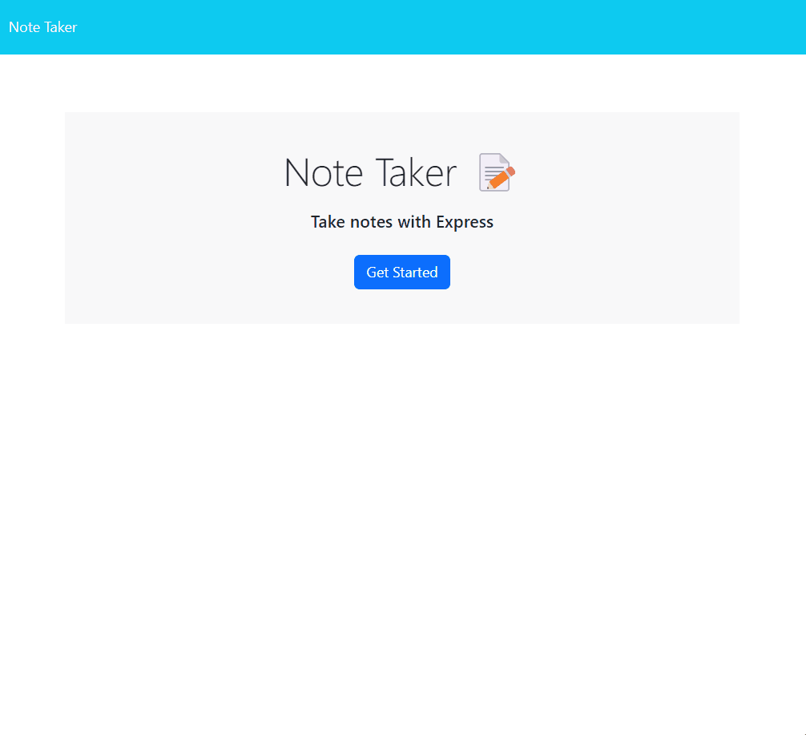

# Note Taker Application

## Description

The Note Taker Application is a simple, yet powerful tool that allows users to write, save, and delete notes. This application was developed with the motivation to create an intuitive and efficient way to manage notes digitally. It solves the problem of disorganization and clutter by providing a centralized platform to store notes securely. Through this project, I learned how to work with Express.js, manage file operations in Node.js, and implement RESTful API routes.

## Table of Contents (Optional)

- [Installation](#installation)
- [Usage](#usage)
- [Credits](#credits)
- [License](#license)

## Installation

To install and run the Note Taker Application on your local machine, follow these steps:

1. **Clone the repository:**

    ```bash
    git clone https://github.com/ogchromebook/note-taker
    ```

2. **Navigate to the project directory:**

    ```bash
    cd note-taker
    ```

3. **Install the necessary dependencies:**

    ```bash
    npm install
    ```

4. **Start the application:**

    ```bash
    npm start
    ```

5. **Open your web browser and go to:**

    ```arduino
    http://localhost:3001
    ```

## Usage

To use the Note Taker Application:

1. Open the application in your web browser.
2. Click on the "New Note" button to create a new note.
3. Enter your note's title and content.
4. Click on the "Save" icon to save your note.
5. Your note will appear in the list on the left-hand side of the screen.
6. To delete a note, click on the "Delete" icon next to the note you want to remove.

Here is a screenshot of the application in action:



## Credits

This application was developed by [Sam Kachergius](https://github.com/ogchromebook).

### Resources:
- [Express.js Documentation](https://expressjs.com/)
- [Node.js File System Module](https://nodejs.org/api/fs.html)
- [Path Module in Node.js](https://nodejs.org/api/path.html)

## License

This project is licensed under the MIT License. See the [LICENSE](LICENSE) file for more details.

---

## Badges


## Features

- Create, view, and delete notes
- Persistent storage of notes using JSON files
- User-friendly interface

## How to Contribute

If you'd like to contribute to the Note Taker Application, feel free to fork the repository, make your changes, and submit a pull request. Contributions are always welcome!

